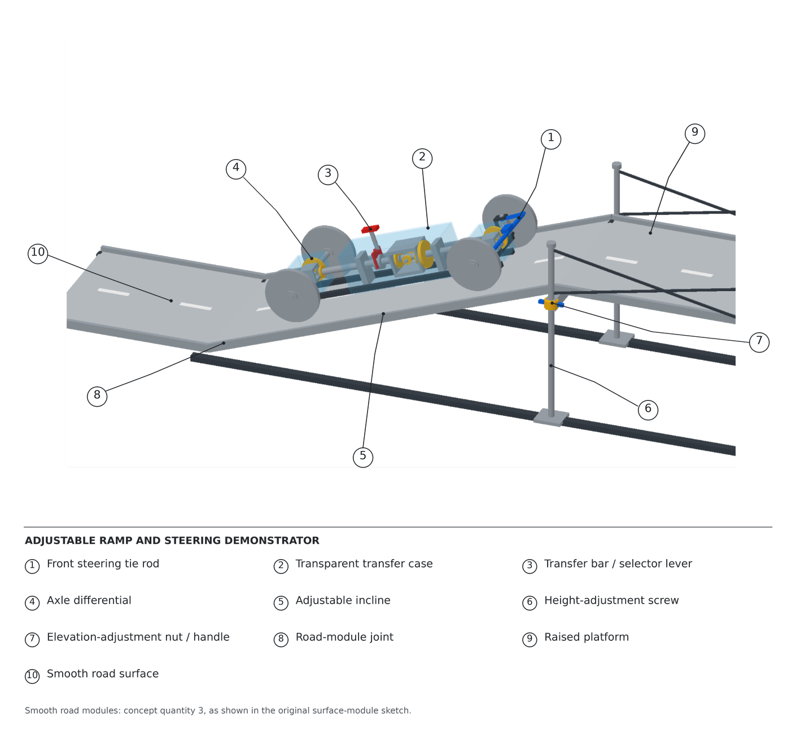
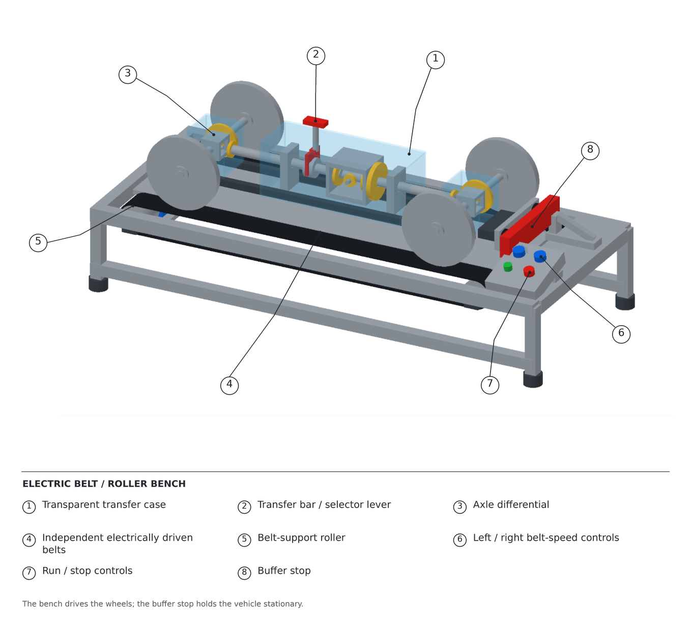
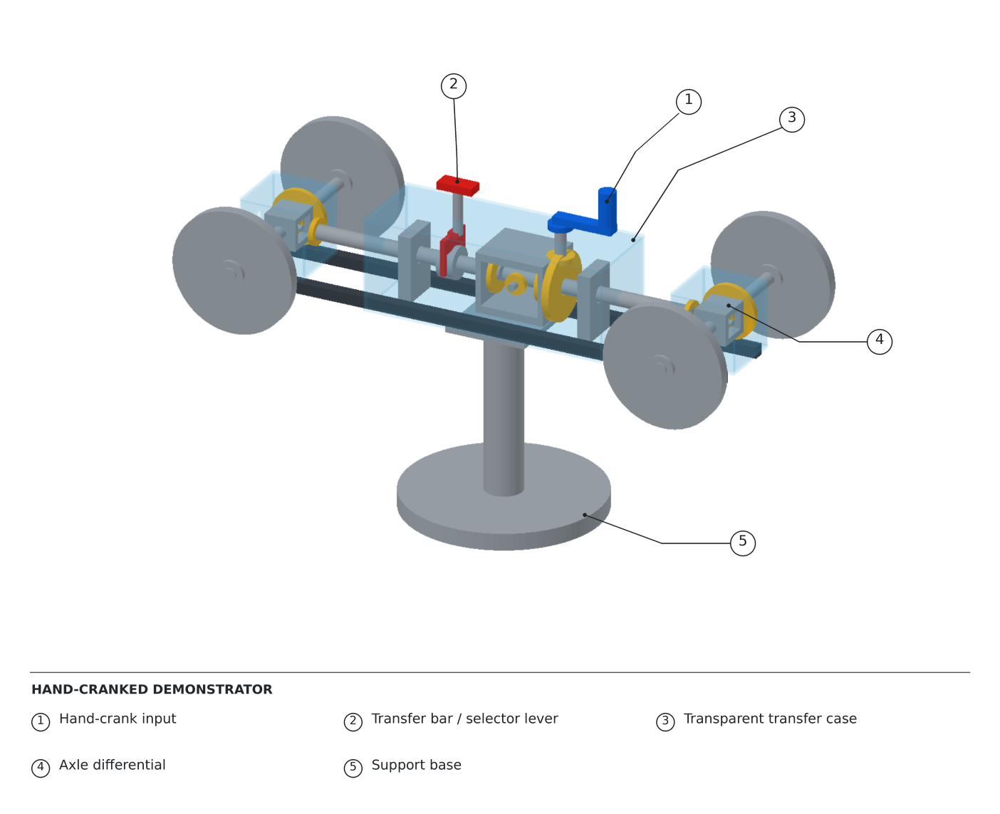

# Candidate Design Presentation

## Candidate Design 1 — Adjustable Ramp and Obstacle Course

### Concept
- A moving vehicle on a modular obstacle course.
- Planned road elements: an adjustable ramp, uneven surfaces, and curved sections; the image shows the smooth ramp sections.
- Proposed vehicle power: an electric motor or another stored-energy mechanism.
- A simple front steering mechanism allows the vehicle to follow a curved path.
- A selector lever switches between 2WD and 4WD.

### Teaching Demonstration
- Compare 2WD and 4WD on uneven surfaces and the incline.
- Observe different wheel speeds during a turn.
- Discuss how differential action accommodates different wheel travel distances.
- Use terrain changes to explore traction and drivetrain behaviour.

### Features
- Transparent transfer case and visible axle differentials.
- Front steering tie rod.
- Adjustable incline with a height-adjustment screw and handle.
- Road-module joints, smooth road sections, and a raised platform.

## Candidate Design 2 — Independent Belt Demonstration Bench

### Concept
- A drivetrain model rests on two independently driven belts, which drive the wheels.
- A stopper holds the vehicle stationary.
- Left and right belt-speed controls create different wheel speeds.
- Unequal belt speeds simulate the left/right speed difference during turning.
- A selector lever changes the drivetrain connections between 2WD and 4WD; belt contact can rotate wheels in either mode.
- Run/stop controls operate the demonstration bench.

### Teaching Demonstration
- Compare wheel motion with equal and unequal belt speeds.
- Observe how an open axle differential accommodates different output speeds.
- With the axle differential locked, unequal belt speeds may cause wheel-to-belt slip or increased resistance.
- Compare open and locked axle-differential operation under the same belt-speed conditions; this requires an axle-lock mechanism beyond the 2WD/4WD selector.
- Slip depends on traction and loading; an open differential does not guarantee zero slip.

### Features
- Independent electrically driven belts and support rollers.
- Separate left/right speed-control knobs.
- Transparent transfer case and visible axle differentials.
- Buffer stop and run/stop controls.

## Candidate Design 3 — Hand-Cranked Stationary Demonstrator

### Concept
- A stationary drivetrain model mounted above a support base.
- Wheels remain suspended and free to rotate.
- Students turn a hand crank to drive the mechanism.
- No steering mechanism or road course.
- A transfer-case selector lever switches between 2WD and 4WD.

### Teaching Demonstration
- Follow the power path from the hand crank to the driven wheels.
- Compare which wheels rotate in 2WD and 4WD.
- Apply different output resistance to demonstrate different wheel speeds.
- Observe differential motion through the transparent enclosure.

### Features
- Hand-crank input and selector lever.
- Transparent transfer case and visible axle differentials.
- Pedestal support and base.

## Presentation Notes
- These images illustrate candidate concepts; they are not verified CAD assemblies or tested prototypes.
- Numbering matches the notebook: CD1 obstacle course, CD2 belt bench, and CD3 hand-cranked demonstrator.
